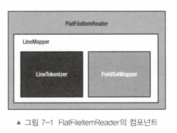
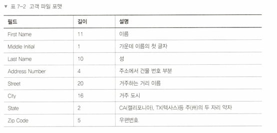
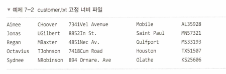

# 개요

웹 애플리케이션, 배치, 그 외의 어떤 프로그램이든 그 기반에는 (1) `어떤 데이터를
읽어서,` (2) `특정 방법으로 처리한 뒤,` (3) `처리된 데이터를 어딘가에 기록`하는 기능이 존재한다.

이런 세가지 개념은 스프링 배치에서 더욱 명확히 드러난다.
청크 기반으로 동작하는 각 스텝은 ItemReader, ItemProcessor, ItemWriter 로 구성된다.

여기서는 `입력` 에 대해 자세히 다뤄볼 것이다.

입력으로 제공될 수 있는 데이터의 유형은 플랫파일, XML, 다양한 데이터베이스 등으로
매우 다양하다.

스프링 배치는 개발자가 별도로 코드를 작성하지 않아도 ⭐️**거의 모든 유형의 데이터를 처리할 수 있는
표준 방법을 제공**하며,
⭐️**웹 서비스로 데이터를 읽어들이는 것처럼 스프링 배치가 지원하지 않는 포맷의 데이터를 처리할 수 있는
커스텀 리더를 개발하는 기능**도 제공한다.

# ItemReader 인터페이스

- ItemReader 는 전략 인터페이스이다
- 스프링 배치는 처리할 입력 유형에 맞는 여러 구현체를 제공한다
- 스프링 배치가 구현체를 제공하는 입력 유형
    - 플랫 파일
    - 여러 데이터베이스
    - JMS 리소스
    - 기타 입력 소스
- ItemReader 인터페이스나 ItemReader 하위 인터페이스 중 하나를 구현해서
  커스텀 ItemReader 를 만들 수도 있다
- 스프링 배치가 ItemReader 의 `read` 메서드를 호출하면, 해당 메서드는 스텝 내에서 치리할
  아이템 한 개를 반환한다.
    - 스텝 내에서는 아이템 개수를 세어서 청크 내의 데이터가 몇 개나 처리됐는지 관리한다.
- 해당 아이템은 특정 ItemProcessor 로 전달되며 그 뒤 청크의 일부분에 포함돼 ItemWriter 로 전달된다.

# 파일 입력

자바에서는 날짜 처리 API 보다 IO 용도의 API 가 성능이 훨씬 좋다.
물론 최근 몇 년 사이에 날짜 처리 API 성능도 훨씬 개선됐지만...
스프링 배치 프레임워크 개발자들이 자바의 고성능 IO 를 활용할 수 있도록
`선언적인 리더`를 다수 제공한다.

개발자는 리더에 `읽으려는 데이터 포맷을 선언하기만 하면` 리더가 나머지 작업을 알아서 처리한다.
지금부터 스프링 배치가 제공하는 `선언적인 리더`를 알아보자.

## 플랫 파일

배치 처리와 관련해, 플랫 파일이란 한 개 또는 그 이상의 레코드가 포함된
특정 파일을 말한다. 플랫 파일은 파일의 내용을 봐도 `데이터의 의미를 알 수 없다`는 점에서
XML 파일과 차이가 있다.

다시 말하자면 플랫 파일에는 파일 내의 데이터 포맷이나 의미를 정의하는 메타데이터가 없다.
그에 반해 XML 파일은 태그를 사용해 데이터에 의미를 부여한다.

### FlatFileItemReader - 스프링 배치의 플랫파일 컴포넌트

`FlatFileItemReader` 컴포넌트는 메인 컴포넌트 두개로 이뤄진다.

- 하나는 대상 파일을 나타내는 스프링의 `Resource`
- 다른 하나는 `LineMapper`
    - `LineMapper` 는 스프링 JDBC 에서 RowMapper 와 비슷!
    - RowMapper 를 사용하면 필드의 묶음을 나타내는 ResultSet 을 객체로 매핑할 수 있음
      

### FlatFileItemReader 구성 옵션

| 옵션                    | 타입                    | 기본값                          | 설명                                                                                                          |
|-----------------------|-----------------------|------------------------------|-------------------------------------------------------------------------------------------------------------|
| comments              | String[]              | #                            | 이 문자열 배열에는 파일을 파싱할 때 건너뛰어야 할 주석 줄을 나타내는 접두어를 지정한다.                                                          |
| encoding              | String                | 플랫폼의 기본 Charset              | 파일에 사용된 문자열 인코딩                                                                                             |
| lineMapper            | LineMapper            | null (필수)                    | 이 클래스는 파일의 한 줄을 String 으로 읽은 뒤 처리 대상인 도메인 객체(아이템)로 변환한다.                                                    |
| linesToSkip           | int                   | 0                            | 잡을 실행할 때 FlatFileItemReader 가 파일을 파싱하기 전에 시작부터 몇 줄을 건너뛸 것인지 지정할 수 있다.                                       |
| recordSeparatorPolicy | RecordSeparatorPolicy | DefaultRecordSeparatorPolicy | 각 줄의 마지막을 정의하는 데 사용한다. 별도로 지정하지 않으면 개행 문자가 레코드의 끝 부분을 나타낸다. 또, 이 클래스는 여러 줄에 걸쳐 따옴표로 감싸진 구문을 다룰 때도 사용할 수 있다. |
| resouce               | Resource              | null (필수)                    | 읽을 대상 리소스                                                                                                   |
| skippedLinesCallback  | LineCallbackHandler   | null                         | 줄을 건너뛸 때 호출되는 콜백 인터페이스. 건너뒨 모든 줄은 이 콜백으로 넘겨진다.                                                              |
| strict                | boolean               | true                         | true 로 설정하면 리소스를 리소스를 찾을 수 없을 때 Exception 을 던진다.                                                            |
| name                  | String                | null                         | ExecutionContext 에 저장되는 값의 고유 키를 생성하는 데 사용된다.                                                               |
| maxItemCount          | int                   | Integer.MAX_VALUE            | 파일에서 읽어들일 아이템의 최대 개수를 나타낸다.                                                                                 |
| currentItemCount      | int                   | 0                            | 현재 조회중인 아이템의 순번. 재시작 시 사용된다.                                                                                |

파일을 읽을 떄는 파일에서 레코드 한 개에 해당하는 문자열이 `LineMapper` 구현체에 전달된다.
가장 많이 사용되는 `LineMapper` 구현체는 `DefaultLineMapper`이다.
`DefaultLineMapper` 는 파일에서 읽은 원시 String 을 대상으로 두 단계 처리를 거쳐 이후 처리에 사용할 도메인
객체로 변환된다.
이 두 단계 처리는 `LineTokenizer` 와 `FieldSetMapper` 가 담당!

- `LineTokenizer` 구현체가 해당 줄을 파싱해 `FieldSet`으로 만든다.
  `LineTokenizer`에 제공되는 String 은 파일에서 가져온 한 줄 전체를 나타낸다.
  레코드 내의 각 필드를 도메인 객체로 매핑하려면 해당 줄을 파싱해 각 필드를 나타내는 데이터의 모음으로 변환할 수 있어야 한다.
  스프링 배치의 `FieldSet`은 한 줄에 해당하는 필드의 모음을 나타낸다.
  이는 데이터베이스로 작업할 때 사용하는 `ResultSet` 과 유사하다.

- `FieldSetMapper` 구현체는 `FieldSet` 을 도메인 객체로 매핑한다.
  `LineTokenizer` 가 한 줄을 여러 필드로 나눴으므로, 이제 각 입력 필드를 도메인 객체의 필드로 매핑할 수 있다.
  이는 스프링 JDBC 에서 RowMapper 가 ResultSet 의 로우를 도메인 객체로 매핑하는 것과 흡사하다.

### 고정 너비 파일

레거시 메인프레임 시스템에서는 고정 너비 파일을 사용하는 것이 일반적이다.
코볼이나 빅데이터를 비롯한 다른 여러 기술에서 고유의 저장공간을 정의할 때 고정 너비 파일을 사용하기 때문.



이 파일을 읽으려면 레코드를 나타내는 도메인 객체가 필요하다.

```java

@Getter
@ToString
@NoArgsConstructor
@AllArgsConstructor
public class Customer {
    private String firstName;
    private String middleInitial;
    private String lastName;
    private String addressNumber;
    private String street;
    private String city;
    private String state;
    private String zipCode;
}
```

```java

@Configuration
public class CopyJobConfiguration {

    @Bean
    @StepScope
    FlatFileItemReader<Customer> customerItemReader(@Value("#{jobParameters['customerFile']}") Resource inputFile) {
        return new FlatFileItemReaderBuilder<Customer>()
                .name("customerItemReader")
                .resource(inputFile)
                .fixedLength() // 고정 너비 파일
                .columns(
                        new Range(1, 11), new Range(12, 12), new Range(13, 22),
                        new Range(23, 26), new Range(27, 46), new Range(47, 62), new Range(63, 64),
                        new Range(65, 69)
                )
                .names(
                        new String[]{
                                "firstName", "middleInitial", "lastName",
                                "addressNumber", "street", "city", "state", "zipCode"}
                )
                .targetType(Customer.class)
                .build();
    }
}
```

고정 너비 파일은 많은 엔터프라이즈 환경에서 배치 처리에 사용되는 입력 유형이다.
`FlatFileItemReader` 와 `FixedLengthTokenizer` 를 사용해서 파일을 객체로 파싱하면
고정 너비 파일을 쉽게 처리할 수 있다.


