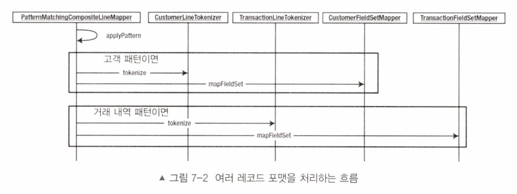

# 배치 잡 설정 클래스
```java
@Configuration
@RequiredArgsConstructor
public class CopyJobConfiguration {
    private final JobBuilderFactory jobBuilderFactory;
    private final StepBuilderFactory stepBuilderFactory;

    @Bean
    Job job() {
        return jobBuilderFactory.get("delimitJob")
                .incrementer(new RunIdIncrementer())
                .start(copyFileStep())
                .build();
    }

    @Bean
    Step copyFileStep() {
        return stepBuilderFactory.get("copyFileStep")
                .<Customer, Customer>chunk(10)
                .reader(customerItemReader(null))
                .writer(itemWriter())
                .build();
    }

    @Bean
    @StepScope
    FlatFileItemReader<Customer> customerItemReader(@Value("#{jobParameters['customerFile']}") Resource inputFile) {
        return new FlatFileItemReaderBuilder<Customer>()
                .name("customerItemReader")
                .lineTokenizer(lineTokenizer())
                .targetType(Customer.class)
                .resource(inputFile)
                .build();
    }

    @Bean
    PatternMatchingCompositeLineMapper lineTokenizer() {
        Map<String, LineTokenizer> lineTokenizers = new HashMap<>(2);

        lineTokenizers.put("CUST*", customerLineTokenizer());
        lineTokenizers.put("TRANS*", transactionLineTokenizer());

        Map<String, FieldSetMapper> fieldSetMappers = new HashMap<>(2);

        BeanWrapperFieldSetMapper<Customer> customerFieldSetMapper = new BeanWrapperFieldSetMapper<>();

        customerFieldSetMapper.setTargetType(Customer.class);
        fieldSetMappers.put("CUST*", customerFieldSetMapper);
        fieldSetMappers.put("TRANS*", new TransactionFieldSetMapper());

        PatternMatchingCompositeLineMapper lineMappers = new PatternMatchingCompositeLineMapper();
        lineMappers.setTokenizers(lineTokenizers);
        lineMappers.setFieldSetMappers(fieldSetMappers);

        return lineMappers;
    }

    @Bean
    DelimitedLineTokenizer customerLineTokenizer() {
        DelimitedLineTokenizer lineTokenizer = new DelimitedLineTokenizer();
        lineTokenizer.setNames("firstName", "middleInitial", "lastName", "address", "city", "state", "zipCode");
        // 로우에서 0번쨰 필드 즉 첫번쨰 필드의 값인 CUST or TRANS 여부를 나탸내는 건 제외하기 위함.
        lineTokenizer.setIncludedFields(1, 2, 3, 4, 5, 6, 7);
        return lineTokenizer;
    }

    @Bean
    DelimitedLineTokenizer transactionLineTokenizer() {
        DelimitedLineTokenizer lineTokenizer = new DelimitedLineTokenizer();
        lineTokenizer.setNames("prefix", "accountNumber", "transactionDate", "amount");
        return lineTokenizer;
    }

    @Bean
    ItemWriter<Customer> itemWriter() {
        return items -> items.forEach(System.out::println);
    }
}

```
`customerItemReader` 구성 코드가 좀 길어지기 시작했다.
리더를 실제로 실행하면 아래와 같은 일이 일어난다.



위 그림에서 볼 수 있듯이, `PatternMatchingCompositeLineMapper` 가 파일에서 각 레코드를 찾아서
미리 정의된 패턴과 비교해본다.

레코드가 `CUST*` 로 시작하면 `PatternMatchingCompositeLineMapper` 는 해당 레코드를 `CustomerLineTokenizer` 에 전달해 파싱한다.
레코드를 FieldSet 으로 파싱한 뒤에는 파싱된 FieldSet 을 `FieldSetMapper` 로 전달한다.

매핑 작업에는 프레임워크가 제공하는 `BeanWrapperFieldSetMapper`를 사용한다.
`BeanWrapperFieldSetMapper` 는 FieldSet 을 도메인 객체의 필드에 매핑한다.

`Customer` 도메인 객체에는 `prefix` 필드가 없다. 따라서 `CustomerLineTokenizer` 가 `prefix`필드를 건너뛰게 해야한다.
그러러면 두가지 작업을 해야한다
- `DelimitedLineTokenizer` 를 구성할 떄 필드명 목록에서 `prefix`라는 이름 제외하기
- 포함하고자 하는 필드의 인덱스 목록을 제공하기

레코드가 `TRANS*` 로 시작하면 해당 레코드를 `TransactionLineTokenizer` 로 전달해 FieldSet 으로 파싱하며,
파싱된 FieldSet 을 `커스텀 TransactionFieldSetMapper` 로 전달한다.

그런데 왜 트랜잭션 로우는 `커스텀 FieldSetMapper` 를 사용할까?
`커스텀 FieldSetMapper`는 일반적이지 않은 타입의 필드를 변환할 때 필요하다.
기본적으로 `BeanWrapperFieldSetMapper` 는 특수한 타입의 필드를 변환할 수 없다.
`Transaction` 도메인 객체에는 `Date` 타입인 `transactionDate` 와 `Double` 타입인 `amount` 가 있다.
그러므로 변환히 필요한 해당 타입을 사용하려면, `커스텀 FieldSetMapper` 를 만들어 사용해야 한다.

`Transaction` 도메인 객체로 매핑할 때는 파일에서 읽은 `String` 을 `Double` 로 변환하도록
`readDouble` 메서드를 사용한다. 또, 파일에서 읽은 문자열을 `Date` 로 파싱하는 `readDate` 메서드를 사용한다.

잡을 실행하면 두가지 종류의 레코드 포맷을 읽은 뒤 각각의 도메인 객체로 파싱할 수 있다.