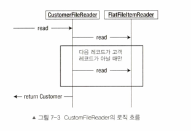

# 개요

지금까지 예제에서는 단순히 개별 레코드 사이에 어떤 관계도 없다고 가정했다.
만약 레코드 사이에 특정한 관계가 있다면 어떻게 해야할까?

지금부터 `여러 줄에 걸친 레코드를 단일 아이템으로 읽어들이는 방법`을 살펴보자.

## 여러 줄에 걸친 레코드

마지막 에제에서는 두 가지 상이한 레코드 포맷을 상호 관련이 없는 두 아이템으로 처리하는 방법을 살펴봤다.
그러나, 파일의 포맷을 좀 더 자세히 살펴보면 파일에서 읽어들인 레코드 사이에 **실제로는 관계가 있음** 을 확인할 수 있다.

거래내역 레코드는 고객 레코드의 하위 정보에 해당하는 레코드다.
각 레코드를 독립적으로 처리하는 대신 `Customer` 객체가 내부에 `Transaction` 객체의 컬렉션을
가지고 있는 것이 좀 더 상식적이다.

이처럼 레코드 사이의 관계를 처리하려면 약간의 트릭이 필요하다. 스프링 배치가 공식 가이드로 제공하는 예제에서는 레코드가
실제로 끝나는 부분을 파악할 수 있게 푸터 레코드를 사용하는데, 실제 배치처리시 만나는 많은 파일에는 푸터 레코드가 포함되어있지 않다.

또한 이번 예제에서는 다음 줄을 읽지 않고는 현재 레코드의 끝에 도달했는지 알 수가 없다.
이를 해결하려면 `CustomerItemReader` 빈에 약간의 로직을 추가해 커스텀 `ItemReader` 를 새로 구현하면 된다.

위 그림에서 알 수 있듯이, `read` 메서드는 `Customer` 객체를 이미 읽어들였는지를 판별하는 것으로 시작한다.
읽어들이지 않았다면 `FlatFileItemReader` 에서 레코드 하나를 읽으려 시도한다.
레코드를 읽어왔다면 `Customer` 객체 내부의 거래 내역 List 를 초기화한다.
그 다움, 읽어들인 레코드가 `Transaction` 이면 이를 `Customer` 객체에 추가한다.

`커스텀 ItemReader` 를 만들기 전에, 도메인 객체를 수정하자. `Customer` 가 `List<Trasaction>`  을 갖고있도록!

## 커스텀 ItemReader

```java
public class CustomerFileReader implements ItemStreamReader<Customer> {

    private Object cutItem = null;
    private final ItemStreamReader<Object> delegate;

    public CustomerFileReader(ItemStreamReader<Object> delegate) {
        this.delegate = delegate;
    }

    @Override
    public Customer read() throws Exception {
        if (cutItem == null) {
            cutItem = delegate.read();
        }

        Customer item = (Customer) cutItem;
        cutItem = null;

        if (item != null) {
            item.setTransactions(new ArrayList<>());

            while (peek() instanceof Transaction) {
                item.getTransactions().add((Transaction) cutItem);
            }
        }
        return item;
    }

    private Object peek() throws Exception {
        if (cutItem == null) {
            cutItem = delegate.read();
        }
        return cutItem;
    }

    @Override
    public void open(ExecutionContext executionContext) throws ItemStreamException {
        delegate.open(executionContext);
    }

    @Override
    public void update(ExecutionContext executionContext) throws ItemStreamException {
        delegate.update(executionContext);
    }

    @Override
    public void close() throws ItemStreamException {
        delegate.close();
    }
}
```

`CustomerFileReader` 에는 주요 메서드가 2개 있다.

`read` 메서드는 하위에 거래 내역 레코드가 포함된 Customer 아이템을 하나 읽어들이고 조합하는 역할을 한다.
먼저 `read` 메서드는 파일에서 고객 레코드를 읽어들인다. 그런 다음 고객 레코드를 만나기 전까지는 현재 처리중인 고객 레코드와
관련된 거래 내역 레코드를 한 줄씩 계속 읽어들인다.
다음 고객 레코드를 발견하면 현재 처리중인 고객의 레코드 처리가 끝난 것으로 간주해
`커스텀 ItemReader` 로 반환한다. 이런 로직을 제어 중지 로직(control break logic)이라고 한다.

다음으로 살펴봐야할 메서드는 `peek` 메서드다. `peek` 메서드는 현재 처리중인 `Customer` 를 처리하는 과정에서
레코드를 미리 읽어 놓는데 사용한다.

이번 예제에서 구현하는 커스텀 리더가 `ItemReader` 를 구현하지 않았다는 점에 주목하자.
이번의 `커스텀 리더` 는 `ItemStreamReader` 인터페이스를 구현했다.

스프링 배치가 제공하는 ItemReader 구현체를 사용하면, 해당 ItemReader 는 읽을 대상 리소스를 열고 닫는 것을
제어할 뿐만 아니라 읽어들인 레코드와 관련된 상태를 ExecutionContext 에 관리한다.

하지만 커스텀 리더를 직접 구현한다면 이러한 리소스 관리와 같은 작업도 직접 수행해야 한다.

`커스텀 리더` 인 `CustomerFileReader` 를 구성하려면 위임 객체의 의존성이 하나 필요하다.
이 커스텀 리더의 위임 객체는 애플리케이션에서 실제로 파일을 읽고 파싱하는 리더이다!

# 마무리

여러 줄로 구성된 레코드는 배치 처리에서 흔히 만날 수 있는 유형임. 한 줄로 구성된
기본적인 레코드 처리보다는 좀 더 복잡하긴 하지만, 커스텀 리더를 작성하면 해결 가능하다.

플랫 파일을 다루는 마지막 작업으로, **여러 개의 파일을 읽어들어야 하는 상황**을 살펴보자.
