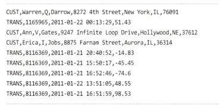

# 개요

구분자로 구분된 파일 (delimited file)은 파일의 포맷이
어떠한지 나타내는 메타데이터가 파일 내에 소량 제공된다.

구분자로 구분된 레코드를 처리할 떄는 `DelimitedLineTokenizer`를 사용해
각 레코드를 `FieldSet`으로 변환한다.

# ItemReader 빈으로 등록하기

```java
    @Bean
@StepScope
    FlatFileItemReader<Customer> customerItemReader(@Value("#{jobParameters['customerFile']}") Resource inputFile){
        return new FlatFileItemReaderBuilder<Customer>()
        .name("customerItemReader")
        .resource(inputFile)
        .fixedLength() // 고정 너비 파일
        .columns(
        new Range(1,11),new Range(12,12),new Range(13,22),
        new Range(23,26),new Range(27,46),new Range(47,62),new Range(63,64),
        new Range(65,69)
        )
        .names(
        new String[]{
        "firstName","middleInitial","lastName",
        "addressNumber","street","city","state","zipCode"}
        )
        .targetType(Customer.class)
        .build();
        }
```

## DelimitedLineTokenizer 의 특성

`DelimitedLineTokenizer`는 매우 유용한 세가지 선택 항목을 제공한다.

- 첫째는 `구분자를 구성하는 항목` 이다. 기본값은 `쉼표` 이다
- 두번째는 `인용문구를 변경`할 수 있다.

  ```java
    John, Doe, "123, Main St.", Springfield
    ```

# 커스텀 FieldSetMapper 구현하기

- 세번째는 `필드 매핑을 자유로이 수정`할 수 있다.

  `addressNumber` 와 `street` 을 `address` 라는 단일 컬럼으로 매핑하여 읽기가 가능해진다.
  새로운 객체 형식을 사용하려면 FieldSet 을 도메인 객체로 매핑하는 방법을 바꿔야 한다.
  그러려면, FieldSetMapper 인터페이스의 **커스텀 구현체** 를 새로 만들어야 한다!

    ```java
    public class CustomerFieldMapper implements FieldSetMapper<Customer> {
      @Override
      public Customer mapFieldSet(FieldSet fieldSet) throws BindException {
          Customer customer = new Customer();
          customer.setAddress(fieldSet.readString("addressNumber") + " " + fieldSet.readString("street"));
          customer.setCity(fieldSet.readString("city"));
          customer.setFirstName(fieldSet.readString("firstName"));
          customer.setLastName(fieldSet.readString("lastName"));
          customer.setMiddleInitial(fieldSet.readString("middleInitial"));
          customer.setState(fieldSet.readString("state"));
          customer.setZipCode(fieldSet.readString("zipCode"));
          return customer;
        }
  }
    ```
  `CustomerFieldSetMapper` 를 사용하려면 구성을 변경해야 한다.
  `BeanWrapperFieldSetMapper`를 참조하는 대신에 커스텀 빈을 참조하도록 교체하자.

  지금까지 살펴본 것처럼 표준 스프링 배치 파서로 파일을 파싱하려면 구성 코드 몇 줄이면 충분하다.
  그러나, 모든 파일이 자바로 처리하기 용이한 포맷에 유니코드로 작성되는 것은 아니다.

  레거시 시스템에서 작업할 때는 커스텀 파싱이 필요한
  데이터 저장 기술이 혼재되어있기 마련!
  커스텀 `LineTokenizer`를 구현해보자.

# 커스텀 레코드 파싱 - LineTokenizer

앞 절에서는 커스텀 `FieldSetMapper` 구현체를 사용해 원하는 대로 매핑 방법을 개조한뒤,
파일 내의 필드를 도메인 객체의 필드로 매핑하는 방법을 살펴봤다.
그러나 커스텀 매퍼를 구현하는 것 이외에도 다른 방법이 있다.
바로 `커스텀 LineTokenizer`를 만드는 것이다.
`LineTokenizer`를 사용하면 원하는 대로 각 레코드를 파싱할 수 있다.

```java
public interface LineTokenizer {
    FieldSet tokenize(String line);
}
```

이번에는 도메인 객체 내의 건물번호와 거리명을 단일 필드로 합쳐보자.
두 항목을 FieldSet 을 만드는 과정에서 단일 필드로 합칠 것이다.
아래는 `CustomerFileLineTokenizer` 의 코드다.

```java
public class CustomerFileTokenizer implements LineTokenizer {
    private final String DELIMITER = ",";
    private final String[] names = new String[]{"firstName", "middleInitial", "lastName", "address", "city", "state", "zipCode"};
    private final FieldSetFactory fieldSetFactory = new DefaultFieldSetFactory();

    @Override
    public FieldSet tokenize(String record) {
        String[] fields = record.split(DELIMITER);
        List<String> parsedFields = new ArrayList<>();

        for (int i = 0; i < fields.length; i++) {
            if (i == 4) {
                parsedFields.set(i - 1, parsedFields.get(i - 1) + " " + fields[i]);
            } else {
                parsedFields.add(fields[i]);
            }
        }

        return fieldSetFactory.create(parsedFields.toArray(new String[0]), names);
    }
}
```

`커스텀 LineTokenizer` 와 `FieldSetMapper` 로 내가 읽고 싶은 방식으로 파일을 읽어들일 수 있다.
특이한 파일 포맷을 파싱해야 하거나, 특수한 타입 변환 요구 조건을 처리할 때 유용하게 쓰일 수 있다.

그러나 모든 파일 처리 작업이 지금까지 살펴본 고객 파일 처리처럼 단순하지는 않다.
만약 *파일에 여러가지 레코드 포맷이 포함되어있다면 어떻게 할 것인가?*

다음 절에서는 파싱해야할 레코드에 따라 스프링 배치가 어떻게 적절한 `LineTokenizer` 를 선택하게 할 수 있을지 알아본다.

# 여러 가지 레코드 포맷일 경우 처리 방법

지금까지 다룬 `customer` 파일 내 레코드는 완벽히 동일한 포맷이었다.
그러나 만약 고객 정보뿐 아니라 고객의 거래 정보까지 담긴 파일을 받았을 때는 어떻게 해야할까?
그렇다. 커스텀 `LineTokenizer` 하나를 새로 구현하면 된다.
그러나 이 접근법에는 두가지 문제점이 있다.

- `복잡도`: 파일 내에 세 가지, 네 가지, 다섯 가지, 아니 그 이상의 레코드 포맷이 존재한다고 해보자. 또 각 레코드 포맷마다
  무수히 많은 필드가 존재한다면 곧 `LineTokenizer` 클래스 하나로는 감당할 수 없게 된다.
- `관심사의 분리`: `LineTokenizer` 의 목적은 레코드를 파싱하는 것 그 이상도 이하도 아니다. 레코드 파싱을 넘어 어떤 레코드 유형인지를 판별하는 데 사용해서는 안된다.

스프링 배치는 이런 점을 감안해 별도의 `LineMapper` 구현체인 `PatternMatchingCompositeLineMapper`를 제공한다.
앞서 설펴본 예제에서는 `DefaultLineMapper`를 사용했다.
`DefaultLineMapper`는 `LineTokenizer` 하나와 `FieldSetMapper` 하나를 사용해 매핑 기능을 제공한다.

반면 `PatternMatchingCompositeLineMapper` 를 사용하면 여러 `LineTokenizer`로 구성된 Map 을 선언할 수 있으며,
각 `LineTokenizer` 가 필요로 하는 여러 `FieldSetMapper` 로 구성된 Map 을 선언할 수 있다.
각 맵의 키는 레코드의 패턴이다. `LineMapper` 는 이 패턴을 이용해서 각 레코드를 어떤 `LineTokenizer` 로 파싱할지 식별한다.



